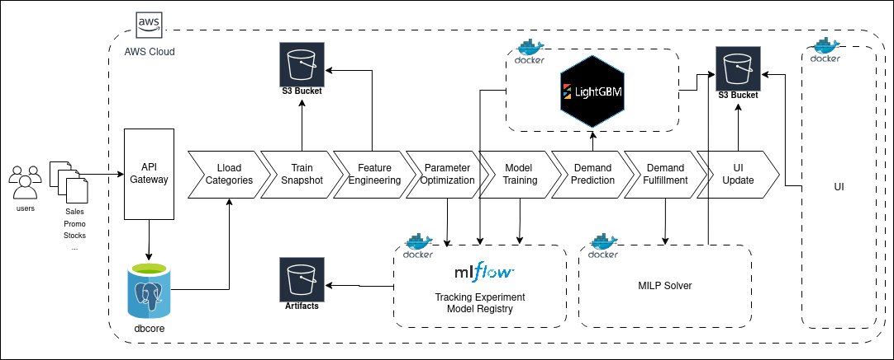
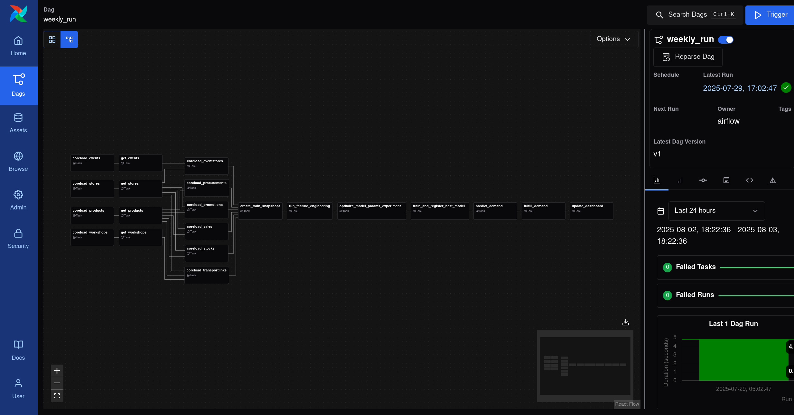
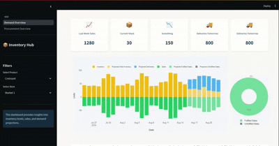

# 🌠 Mercanova

*The new intelligence for retail.*

**Mercanova** is an AI-native platform that empowers retail stores to predict demand accurately and optimize fulfillment operations through mathematical optimization, machine learning, and control console.

Designed for precision. Built for optimization. Trusted for automatization.

---

## 🚀 Overview

Retail demand is chaotic — Mercanova brings order. The problem addresses the complexities of retail supply chains by combining advanced demand forecasting with optimization techniques to ensure that products are available where and when they are needed. The idea is simple: **use data to predict what customers will buy, and then optimize how to get those products to the right stores at the right time.**

For this, Mercanova integrates the following components:

- **Predict demand** at product/store/day granularity using sales, promotions, events, and seasonality features  
- **Optimize replenishment & fulfillment** strategies that minimize shipping costs, overstocks, understocks while maximizing demand satisfaction
- **Central Console** filled with dashboards for insights into sales patterns, inventory levels, and fulfillment performance
- **Standarized & Intuitive APIs** for just plug-and-play with your retail data
- **Data Pipeline** for efficient ETL/ELT operations, feature engineering, and model training
- **Monitoring & Alerting** for demand anomalies, fulfillment issues, and performance metrics
- **Modular Architecture** that allows for easy extension, customization, and integration with third-party services
- **Scalable & Cloud-Native** design that supports batch and real-time data processing
- **User-Friendly Interface** for business users to interact with the system, view insights, and manage operations

Mercanova tackles the complexities of retail demand and fulfillment by combining advanced machine learning techniques with mathematical optimization. It provides a comprehensive solution that not only predicts demand but also optimizes how to meet that demand efficiently.

---

## 🎯 Project Goals

- Deliver high-fidelity demand forecasts using time series and causal models
- Solve multi-objective fulfillment optimization problems (inventory, cost, service)
- Create a modular and reusable backend architecture
- Provide a clean, extensible interface for user interaction

---

## 🛠️ Tech Stack

- **Demand Prediction**: ML models fine-tuned to all store/product combinations using LightGBM to capture seasonality, promotions, and trends
- **Fulfillment Optimization**: MILP/LP-based models that solve for constraints like demand satisfaction, max/min inventory levels, packaging restrictions, and shipping costs using the open-source solver OR-Tools
- **Super Fast Data Pipelines**: ETL/ELT pipelines built with Polars for efficient data processing, feature engineering, and interaction with PostgreSQL
- **Orchestration tool**: Synchronizing all components can be difficult, so we use Metaflow to orchestrate the entire workflow, from data ingestion to model training and dashboard updates
- **Scalable Architecture**: Every component is contenarized via Docker using cloud-native AWS services (S3, EC2, Lambda) for scalability and reliability
- **All-in-One User Interface**: A modern, responsive UI built with Streamlit for demand insights, inventory management, fulfillment tracking, and data monitoring
- **Classic & Reliable Tech Stack**: Python for backend logic, PostgreSQL for data storage, FastAPI for APIs

---

## ⚙️ Architecture Overview



### Explaining Components

| Module            | Description |
|------------------|-------------|
| `api_gateway`  | User sends the data to the API in JSON format,. Each data category is well defined in the API schema. The data schema is built using SQLModel, an modern ORM which has a seamless compatibility with FastAPI and automatically verifies the data types, formats, and constraints of the incoming data. |
| `orchestration`  | Metaflow orchestrates the entire workflow. It's configured to run daily to ensure that the data is always up-to-date. Metaflow handles the scheduling, execution, and monitoring of the entire pipeline, ensuring that all components below work together seamlessly. | 
| `feature_pipeline`  | ML models for time series & causal demand forecasting |
| `model_fit`  | ML models for time series & causal demand forecasting |
| `demand_prediction`  | ML models for time series & causal demand forecasting |
| `demand_fulfillment`      | Mathematical optimization for allocation, replenishment |
| `ui_snapshots`    | REST or GraphQL API to expose platform capabilities |
| `dashboard`  | ETL/ELT pipelines for ingest, transform, feature prep |


---

## 📦 How to Use Mercanova

### Requirements
- uv
- Docker
- Docker Compose

### Setup (Local)

```bash
git clone https://github.com/your-org/mercanova.git
cd mercanova
make run  # Or poetry/pipenv/etc.
```

to stop the server, run:

```bash
make down
```

Upload sample data from Favorita retail dataset: [link](https://www.kaggle.com/datasets/rodrigodf/favorita-grocery-sales-forecasting)

```bash
uv run python upload_sample.py
```

## 📊 Run the Pipeline
By default, the pipeline is set to run weekly. You can trigger it manually by entering the Airflow UI at `http://localhost:8080` and running the `weekly_run` DAG.



## 🎬 Exploring the UI

Go to `http://localhost:8501` to access the Mercanova UI. Select the "Demand Overview" tab to view the demand forecast plots, "Procurement Overview" to see order recommendations, and fulfillment optimization tables.



## 🧩 Extensibility

You can plug in your own:

- Custom ML models (/services/demand_forecast/forecasters.py)
- Supply constraints for optimization (/services/demand_fulfillment/fulfillment.py)
- Add more dashboards (/services/dashboard/pages/)


## 🤝 Contributing

We welcome contributions!
See CONTRIBUTING.md for details.
🧠 Inspiration Behind the Name

"Mercanova" combines the legacy of commerce ("mercato") with the vision of innovation ("nova"). It's a system designed to make markets smarter, more adaptive, and more efficient—through intelligence, not guesswork.

## 📜 License

MIT (or other) — See LICENSE
🌌 Final Thought

"Prediction is not about knowing the future — it's about preparing better options for it."
– Mercanova Design Philosophy